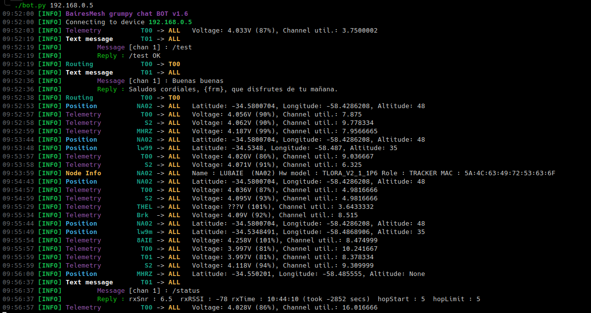

# Meshtastic Grumpy Bot

This is a simple bot using Meshtastic Python API to handle incoming messages and answering to some of them, sometimes providing useful information and some other times with bad mood.

## Overview

This script leverages the power of Meshtastic Python letting users obtain information about their nodes.

- Supported commands are:
    - /ping or /test : Answers user. Helpful to see if the node is successfully connected to the mesh.
    - /info or /status : Shows users RSSI and SNR of the message received by the node. Useful for range tests.

The rest of the time the bot will answer with a welcome message based on the time of the day and sometimes will just be a bad bot :-)

## Usage

```sh
git clone git@github.com:smuniz/mesh_grumpy_bot.git
cd mesh_grumpy_bot
pip install -r requirements
./bot <device>
```

The parameter named *\<device\>* can either be an IPv4 address, a serial device (i.e. /dev/cu.xxx) or a BLE (Bluetooth Low Energy) UUID.




# Meshtastic Argentina

This project is part of [Meshtastic Argentina users group](https://github.com/orgs/Meshtastic-Argentina/)
Join us on Telegram at [Meshtastic Argentina group](https://t.me/meshtastic_argentina)

